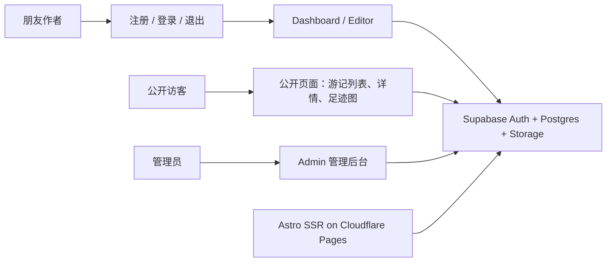

# 旅行共写小站设计

## 目标

将当前 `travel_blog` 从单人静态旅行博客升级为一个面向 5-10 位朋友的旅行共写小站。小站支持邀请码注册、账号密码登录、多人写游记、图片压缩上传、中国足迹图和公开游记浏览，同时尽量保持免费、轻量、可维护。

第一版的核心体验是：朋友拿到邀请码后注册账号，登录后台写一篇包含时间、地点、城市、正文和照片的简单游记，发布后自动出现在公开游记列表、文章详情页和足迹图中。站点主人拥有管理员权限，可以管理邀请码、用户角色和所有游记。

## 设计原则

- **朋友小圈子优先**：系统服务 5-10 人，不按开放社区设计，避免评论、关注、复杂审核和通知系统。
- **免费优先**：优先使用 Supabase Free、Cloudflare Pages Free、本地地图数据和浏览器端图片压缩，避免商业地图 API 和付费图片处理服务。
- **权限在数据库兜底**：前端只负责体验，真正的读写权限由 Supabase RLS 控制。
- **先跑通写作闭环**：先完成注册、登录、写作、发布和公开阅读，再逐步增强图片、地图和视觉氛围。
- **保留 Astro 内容体验**：沿用 Astro 的页面组织和轻量前端风格，但切换到 SSR 以支持登录态、dashboard 和动态数据。

## 技术架构

项目继续使用 Astro，但从纯静态输出升级为 SSR，并部署到 Cloudflare Pages。Supabase 承担认证、数据库、对象存储和 RLS 权限。



### 主要依赖

- `astro`：页面、路由、SSR。
- `@astrojs/cloudflare`：Cloudflare Pages SSR 适配器。
- `@supabase/supabase-js`：浏览器端和服务端访问 Supabase。
- `@supabase/ssr`：基于 cookie 的服务端会话。
- 图片压缩库：优先选择浏览器端压缩方案，第一版控制输出尺寸和质量，不依赖 Supabase 付费 Image Transformations。
- 地图渲染：优先使用本地中国地图数据加前端 SVG 或 ECharts 风格渲染，不接商业地图服务。

## 用户与角色

第一版保留三个角色：

- `admin`：站点主人。管理邀请码、用户角色和所有游记。
- `author`：朋友作者。可以创建、编辑、删除、发布自己的游记。
- `reader`：预留角色。可以登录查看内部内容，但第一版可以不暴露 reader 注册入口。

注册必须填写邀请码。邀请码默认最多可用 10 次，用完后失效，只能由 `admin` 重新生成。通过邀请码注册的用户默认获得 `author` 角色。

角色不存放在用户可编辑的 metadata 中，而是存放在 `profiles.role`。修改角色只能由 `admin` 执行。

## 数据模型

### profiles

存储用户资料和角色。

```text
profiles
- id uuid primary key references auth.users(id)
- display_name text not null
- avatar_url text
- role text not null check role in ('admin', 'author', 'reader')
- map_color text not null
- created_at timestamptz not null
- updated_at timestamptz not null
```

`map_color` 用于足迹图标记颜色。注册时自动分配一个默认颜色，管理员后续可以调整。

### invite_codes

存储管理员生成的邀请码。

```text
invite_codes
- id uuid primary key
- code text unique not null
- role_to_grant text not null default 'author'
- max_uses integer not null default 10
- used_count integer not null default 0
- is_active boolean not null default true
- expires_at timestamptz
- created_by uuid references profiles(id)
- created_at timestamptz not null
- updated_at timestamptz not null
```

邀请码消耗必须通过数据库函数完成，原子检查 `is_active`、`expires_at` 和 `used_count < max_uses`，避免多人同时注册时超用。

### trips

存储游记主体。

```text
trips
- id uuid primary key
- author_id uuid not null references profiles(id)
- title text not null
- slug text unique not null
- summary text
- content text not null
- destination_name text not null
- visited_at date not null
- province text not null
- city text not null
- latitude numeric
- longitude numeric
- status text not null check status in ('draft', 'published')
- cover_image_path text
- created_at timestamptz not null
- updated_at timestamptz not null
- published_at timestamptz
```

朋友可以自己发布，不需要管理员审核。`draft` 只对作者本人和管理员可见；`published` 对所有访客可见。

### trip_assets

存储图片元数据。

```text
trip_assets
- id uuid primary key
- trip_id uuid not null references trips(id) on delete cascade
- owner_id uuid not null references profiles(id)
- storage_path text not null
- mime_type text not null
- size_bytes integer not null
- width integer
- height integer
- created_at timestamptz not null
```

实际图片文件放在 Supabase Storage bucket，例如 `trip-images`。路径按用户和游记隔离：

```text
trip-images/{user_id}/{trip_id}/{image_id}.webp
```

## RLS 权限设计

所有暴露到 Supabase Data API 的表都必须启用 RLS。

### profiles

- 用户可以读取公开资料字段，如昵称、头像和地图颜色。
- 用户可以更新自己的 `display_name` 和 `avatar_url`。
- 用户不能更新自己的 `role`。
- 只有 `admin` 可以修改任何人的 `role` 和 `map_color`。

### invite_codes

- 只有 `admin` 可以创建、读取、停用邀请码。
- 普通用户不能直接读取邀请码列表。
- 注册流程通过受控数据库函数验证和消耗邀请码。

### trips

- 任何人可以读取 `status = 'published'` 的游记。
- 作者可以读取、创建、更新、删除自己的游记。
- 作者可以把自己的草稿发布为 `published`。
- `admin` 可以读取、更新、删除所有游记。

### trip_assets 和 Storage

- 任何人可以读取已发布游记关联的图片。
- 作者可以上传和管理自己路径下的图片。
- 作者不能写入其他用户目录。
- `admin` 可以管理所有图片。
- 如果使用 Storage upsert，需要明确配置 `INSERT`、`SELECT`、`UPDATE` 权限。

## 页面与功能

### 公开页面

- `/`：首页，展示站点介绍、最新游记、足迹入口和视觉背景。
- `/trips`：公开游记列表，只展示已发布游记。
- `/trips/[slug]`：公开游记详情，展示标题、作者、时间、地点、正文、照片。
- `/footprints`：中国足迹图，展示已发布游记的城市点位和作者颜色。

### 认证页面

- `/auth/register`：邀请码注册，字段包括邮箱、密码、昵称、邀请码。
- `/auth/login`：账号密码登录。
- `/auth/logout`：退出登录并重定向。

### 作者后台

- `/dashboard`：我的游记列表，区分草稿和已发布。
- `/dashboard/trips/new`：新建游记。
- `/dashboard/trips/[id]/edit`：编辑游记。

编辑器第一版使用普通表单和文本区域，不做复杂富文本。字段包括标题、摘要、正文、旅行日期、省份、城市、可选经纬度、封面图和图片列表。

### 管理后台

- `/admin`：管理员入口。
- `/admin/invites`：生成、停用邀请码，查看使用次数。
- `/admin/users`：查看用户列表，修改角色和地图颜色。
- `/admin/trips`：查看和管理所有游记。

## 足迹图设计

第一版采用“全国省级轮廓 + 城市彩色点位”的设计，不接商业地图 API。

- 省级轮廓作为底图，表达中国地图整体形状。
- 城市点位来自已发布游记的 `province`、`city`，可选使用经纬度提高定位精度。
- 不同作者使用 `profiles.map_color` 显示不同颜色。
- 同一城市多人去过时，显示多个小圆点或聚合标记。
- hover 展示城市名、作者和游记数量。
- 点击城市后展示该城市相关游记列表。

这样可以保持免费、轻量、视觉清楚，也避免真实地图瓦片、商业授权和坐标偏移问题。

## 图片策略

图片上传前在浏览器端压缩，目标是控制免费存储用量。

- 默认最长边压缩到 1600px。
- 默认输出 WebP，质量 0.75-0.85。
- 单张压缩后建议小于 500KB。
- 第一版每篇游记限制最多 12 张图片。
- 上传前显示预览和压缩后体积。
- 上传到 Supabase Storage 后，在 `trip_assets` 保存元数据。

网页视觉可以按需要生成少量背景图、封面占位图或纹理图片，但生成素材应放在 `public/images/`，并避免让页面依赖远程图片服务。

## 免费额度与成本控制

### Supabase Free

对 5-10 位朋友足够使用。需要注意：

- 数据库 500MB。
- Storage 1GB。
- Egress 5GB。
- 免费项目 1 周不活跃会暂停。

控制策略：

- 图片必须压缩。
- 不保存原图。
- 限制每篇图片数量。
- 定期清理未关联游记的孤儿图片。

### Cloudflare Pages Free

适合部署 Astro SSR。静态资源请求免费且不限量；SSR 页面和 API 会计入 Pages Functions / Workers 免费额度。5-10 人使用量很低，预计不会触碰免费限制。

## 部署设计

Cloudflare Pages 使用 GitHub 仓库自动部署。

生产配置：

```text
Build command: npm run build
Build directory: dist
Production branch: main
```

环境变量：

```text
PUBLIC_SUPABASE_URL
PUBLIC_SUPABASE_PUBLISHABLE_KEY
```

服务端不得暴露 Supabase secret key 或 service role key。第一版尽量通过用户会话和 RLS 完成所有业务，不在前端或 Cloudflare 环境变量里使用 service role。

## 实施阶段

### 阶段 1：Supabase 基础和权限

- 创建 Supabase 项目。
- 设计并执行 schema migration。
- 创建 `profiles`、`invite_codes`、`trips`、`trip_assets`。
- 创建邀请码消耗函数。
- 配置 RLS 和 Storage policy。
- 初始化管理员账号。

### 阶段 2：Astro SSR 和认证

- 安装 Cloudflare adapter 和 Supabase SSR 依赖。
- 配置 Astro SSR。
- 实现注册、登录、退出和会话保护。
- 注册时校验并消耗邀请码。

### 阶段 3：写作后台

- 实现 dashboard 游记列表。
- 实现新建和编辑游记。
- 支持保存草稿和直接发布。
- 支持作者管理自己的游记，管理员管理全部游记。

### 阶段 4：图片上传

- 实现浏览器端图片压缩。
- 上传到 Supabase Storage。
- 写入 `trip_assets`。
- 支持设置封面图和删除图片。

### 阶段 5：公开展示和足迹图

- 实现公开游记列表和详情页。
- 实现中国足迹图。
- 支持按城市查看相关游记。
- 优化首页视觉，可以生成或加入轻量背景图。

### 阶段 6：Cloudflare Pages 部署

- 配置 Cloudflare Pages。
- 设置环境变量。
- 验证注册、登录、写作、上传、公开阅读和足迹图。

## 测试与验收

第一版完成后需要验证：

- 未登录用户只能访问公开页面。
- 无邀请码不能注册。
- 邀请码最多使用 10 次，用完后失效。
- 普通作者不能修改自己的角色。
- 作者只能编辑自己的游记。
- 作者可以直接发布自己的游记。
- 管理员可以管理邀请码、用户角色和所有游记。
- 已发布游记出现在列表、详情和足迹图中。
- 草稿不会出现在公开页面和足迹图中。
- 图片上传前会压缩，上传后可以在文章中显示。
- `npm run check` 和 `npm run build` 通过。
- Cloudflare Pages 部署后核心流程可用。

## 风险与取舍

- **Supabase Free 项目暂停**：免费项目长期无人访问会暂停。接受这个限制，必要时手动恢复。
- **Storage 容量有限**：通过压缩、不保存原图和限制图片数量控制。
- **市级地图数据维护**：第一版使用省级轮廓加城市点位，避免全国市级边界数据过大。
- **SSR 带来部署复杂度**：必须使用 Cloudflare adapter，并确认 Supabase SSR cookie 在 Pages Functions 中工作正常。
- **邀请码注册的原子性**：必须用数据库函数处理邀请码消耗，不能只在前端或普通两步查询中递增。

## 不包含范围

第一版不做评论、点赞、关注、复杂富文本编辑器、审核流、商业地图底图、实时协作、邮件通知、移动 App、付费会员或多租户组织管理。
